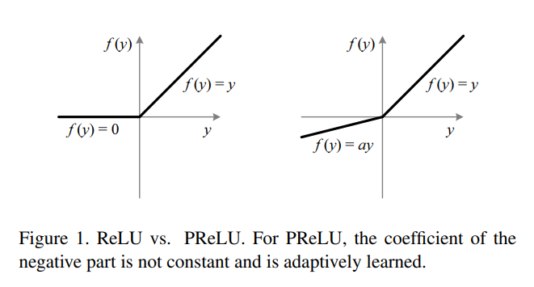
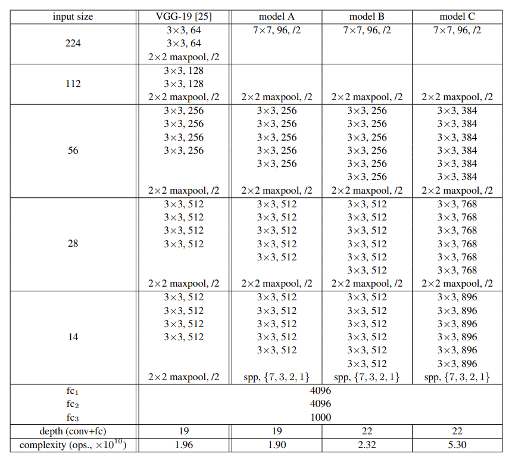

# PReLU Experiments Implementation with Pytorch

## 0. Develop Environment
- Docker Image : tensorflow/tensorflow:1.13.2-gpu-py3-jupyter
- Pytorch : Stable (1.5) - Linux - Python - CUDA (10.2)
- Using Single GPU (not tested on cpu only)

## 1. Explain about Implementation

## 2. Brief Summary of *'Delving Deep into Rectifiers: Surpassing Human-Level Performance on ImageNet Classification'*

### 2.1. Goal
- Activation function that improves model fitting with nearly zero extra computational cost and little overfitting risk
- Robust initialization method which enables to train extremely deep rectifier models directly from scratch and to investigate deeper or wider network architectures

### 2.2. Intuition

- PReLU : avoid zero gradient on ReLU
- He initialization : help convergence of very deep rectified models trained directly from scratch (wanna see the details, see Theory.ipynb)

### 2.3. Dataset
- ILSVRC-2012 dataset
  * train : 1.2 M
  * val : 50 K
  * test : 100 K

### 2.4. Experiments Configurations

### 2.5. Classification Task
#### 2.5.1. Train  
- Data Pre-processing
  * Downsample
    * Rescale image with shorter side of length 256
    * Center crop 256 * 256
  * Random crop 224 * 224
  * Random horizontal flipping
  * Random RGB color shift
  * Normalization : subtract mean RGB value computed on training dataset from each pixel
- Train Details
  * Multinomial logistic regression objective
  * Mini-batch gradient descent based on backpropagation
    * Batch size : 128
    * Learning rate : 0.01
    * Momentum : 0.9
    * L2 weight decay : 0.0005
  * Learning rate scheduler : decrease by a factor of 10 when the validation set accuracy stopped improving
  * Dropout : 0.5 ratio for first 2 FC layer
  * Cycles : 90

#### 2.5.2. Test
- Data Pre-processing
  * Downsample
    * Rescale image with shorter side of length 256
    * Center crop 256 * 256
  * 10-crop : horizontal flip + 5-crop (4 corner + center)
- Test Details
  * No dropout : use all neurons but multiply output by 0.5
- Ensemble
  * Combine the outputs of several models by averaging their soft-max class posteriors
  * Improves the performance due to complementarity of the models

## 3. Reference Paper
- Delving Deep into Rectifiers: Surpassing Human-Level Performance on ImageNet Classification [[paper]](https://arxiv.org/pdf/1502.01852.pdf)
